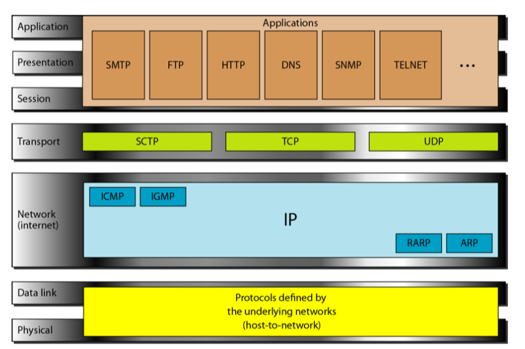
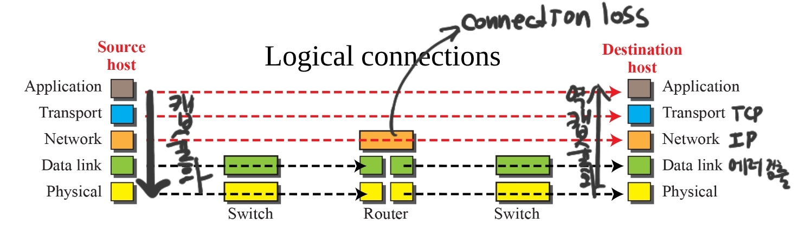

# Network Models

## OSI 모델

## OSI모델의 한계
- TCP/IP이외의 다른 모델로의 변경은 많은 비용이 필요
- OSI모델의 일부 계층은 완전이 정의되지 않음
- OSI 개발시 충분히 높은 수준의 성능을 보여주지 못함

## 레퍼런스
- Data Communications ans Networking (Behrousz A. Forouzan)