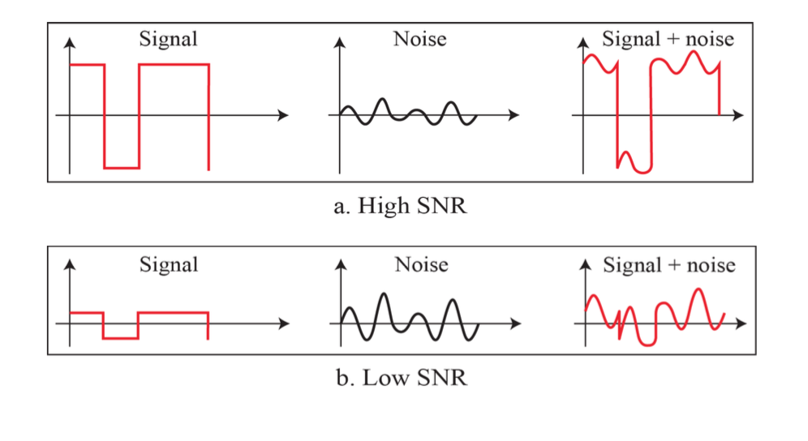

# Data and Signals

## 아날로그 및 정현파
- 아날로그 신호
    - 정현파를 가짐 
        - 정형파의 세가지 특징
            - 최대 진폭
            - 주파수
            - 위상
    - 주파수
        - 매초당 사이클 수인 Hz로 표시
        - 주기의 역
    - 주기
        - 주기는 초로 나타냄
        - 주파수의 역
    - 위상: 0초를 기준으로 shift된 정도
    - 파장: 단순신호가 한 주기 동안 진행할 수 있는 거리
        - 전파 속도: 데이터를 한 주기 안에 보낼 수  있는 거리린가(?) 
    - 복잡신호: 여러 정현파 신호가 결합된 신호

## 디지털 신호
- 준위: 신호가 갖을 수 있는 레벨 (각 준위는 logL개의 비트를 보낸다)

## bps
- bps: 초당 전송 비트(bit per second)의 약자

## 전송장애
- 감쇄: 에너지 손실
- 일그러짐: 신호의 모양이 변경되는 손실
- 잡음
    - 열 잡음
    - 유도된 잡음
    - 혼선
    - 충격 잡음

## 데이터 전송율의 제한
- SNR : 신호대 잡음 비 (Signal to Noise Ratio)
    ```
    SNR = (signal power)/(noise) 
    ```



- Nyquist rate (Maximun 비트레이스를 구할 수 있음(노이즈 고려 안함))
    ```
    BitRate = 2 * bandwidth * logL(준위)
    ```

- Shannon capacity (노이즈를 고려)
    ```
    Capacity = bandwidth * log(1 + SNR)
    ```

## 레퍼런스
- Data Communications ans Networking (Behrousz A. Forouzan)