# Digital Transmission

## Digital-to-Digital Conversion
- Line Coding(회선 부호화)
    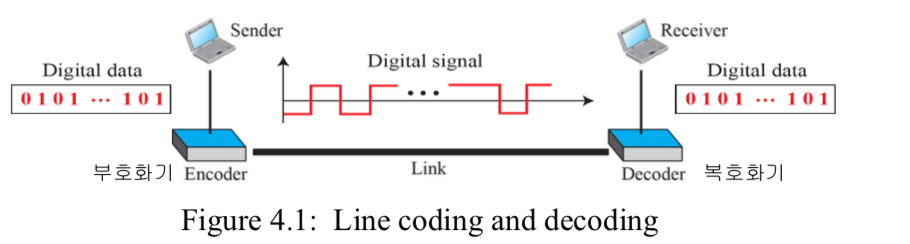
    - 단극형-NRZ: 시간축을 기준으로 전부 위 또는 아래 신호 준위의 값 이용
       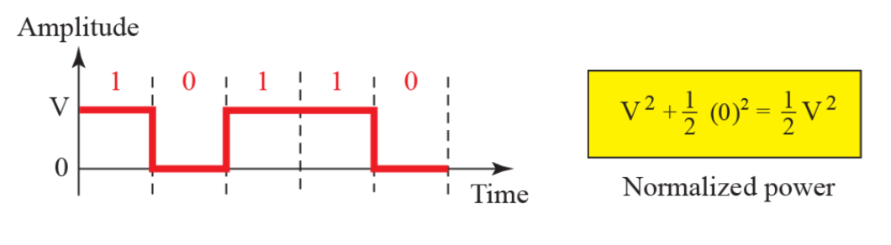 
       - 신호 준위가 양일 때 비트 1, 0일 때 비트 0

    - 극형 - NRZ-L, NRZ-I, RZ, Biphase (Manchester, Differential Manchester) 
        - NRZ-L: 전압 준위가 비트의 값을 결정
        - NRZ-I: 전압 변화가 없으면 0, 전압이 바뀌면 1
         (기준선 표류 문제와 동기화 문제 발생 가능)
            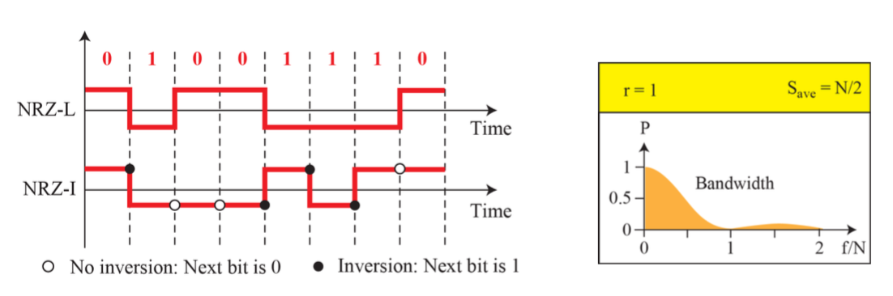
        - RZ
            - 양, 음, 0 세가지 값은 사용
            - 매 비트 구간 신호가 바뀜
            - 비트1: 0에 대한 양으로 표현
            - 비트0: 0에 대한 음으로 표현
            - 단점: 한  비트를 위해 두 번의 신호 변화가 필요함 (많은 대역폭 차지)
            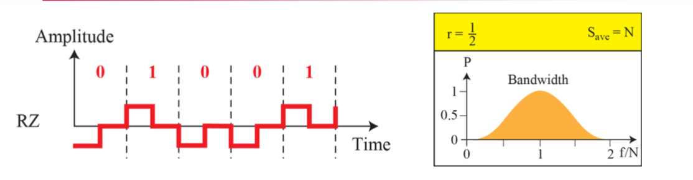
        - 맨체스터 
            - 맨체스터: 동기화와 비트 표현을 위해 비트 중간지점에서 신호 전이를 사용
            - 차분 맨체스터: RZ + NRZ-I
            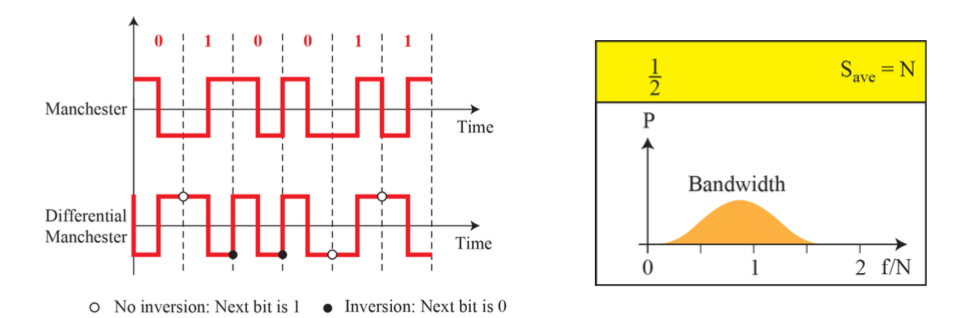       
    - 양극형-AMI,Pseudoternary
        - AMI: 교대로 나타나는 반전되는 1
            - 비트0: 중립의 0전압, 비트1: 교대 되는 양과 음의 전압
        - Pseudoternary
            - 비트1: 전압 준위 0, 비트0: 양과 음의 전압의 교대
        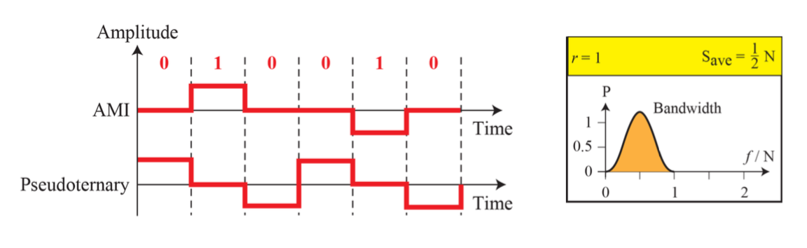
    - 다준위-2B1Q,8B6T
        - L개의 서로 다른 준위를 사용해 L^n개의 신요 요소를 만듬

        - 2B1Q: 2개의 비트 패턴을 4개의 전압 중 각각으로 부호화 
            - 2^m <= L^n이 되야 함
            - Rules: 00 -> -3, 01 -> -1, 10 -> +3, 11 -> +1

            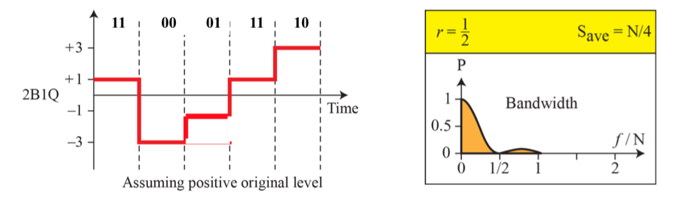
        - 8B6T: 8개의 비드 패턴을 6개의 신호 요소로 나타냄 (3개의 준위를 갖는다)
            - 256(2^8)개의 데이터 패턴과 729(3^6)개의 신호 패턴, 사용되지 않는 패턴은 동기화나 오류 검색에 사용
    - 다중회선-MLT-3
        - Rules
            1. 다음 비트가 0이면 준위 변화 없음
            2. 다음 비트가 1이고 현재 준위가 0이 아니면 다음준위는 0
            3. 다음 비트가 1이고 현재 준위가 0이면 다음 준위는 마지막으로 0이 아니였던 준위의 역
        - why MLT-3?
            - 요구 대역폭을 줄인다
            - 구리선(동축 케이블)dp 100Mbps의 데이터 전송이 가능(LAN)
        
- Block coding (4B/5B)
    - NRZ-I의 문제인 동기화 문제를 해결하기 위해 4B/5B 부호화를 이용하여 연속되는 0이 생기지 않도록 비트 스트림으 로 수정
    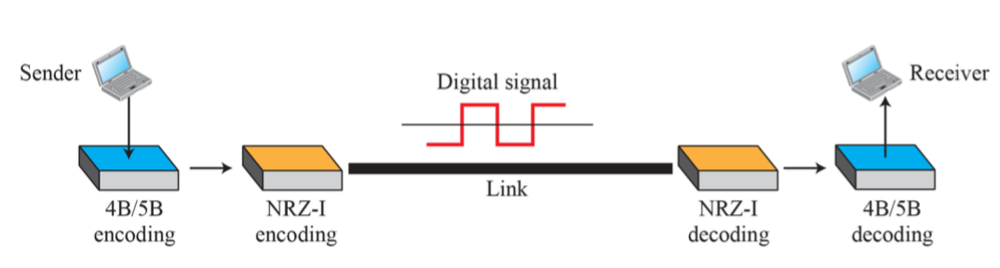
    - 4B/5B 테이블
        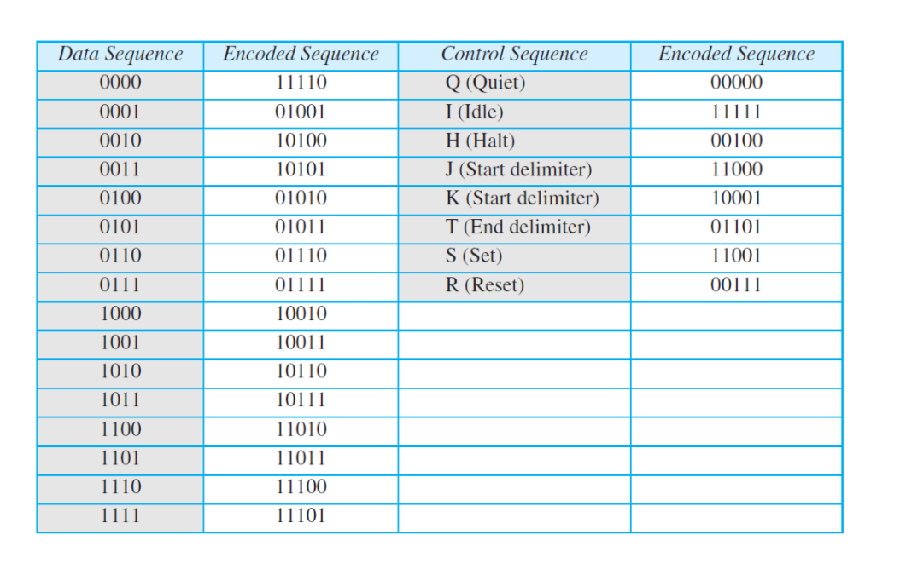
## Analog-to-Digital Conversion
- PCM (Sampling, Quantization, Encoding)
    1. 채집: 아날로그 신호를 채집
    2. 계수화: 채집된 신호를 계수화
    3. 부호화: 계수화된 값을 비트 스트림으로 부호화
    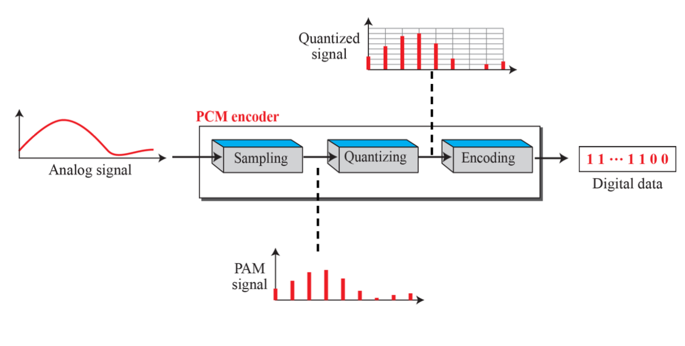

    - PAM: 펄스 진폭 변조 - 채집과정
        - 채집률은 대역폭이 아니라 가장 높은 주파수 보다 최소한 두 배가 되어야 한다
        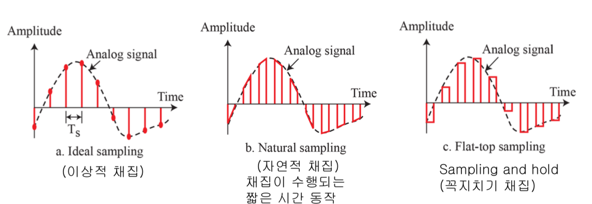
    - 계수화
        1. 원래의 아날로그 신호는 Vmin과 Vmax 사이의 진폭값을 순간적으로 갖는 다고 가정
        2. 전체영역을각각높이Δ(델타)의L개구간으로나눈다. Δ=(Vmax – Vmin) /L
        3. 각구간의중간점에0부터L–1까지의계수화된값을지정 
        4. 채집된신호의진폭값을계수화된값의근사값으로지정
        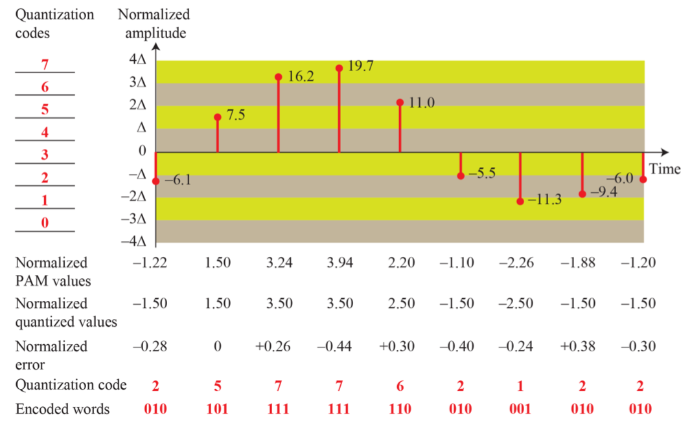
    - 부호화
        - 계수화 준위 개수가 L 이면 비트 수는 n = logL
## 레퍼런스
- Data Communications ans Networking (Behrousz A. Forouzan)