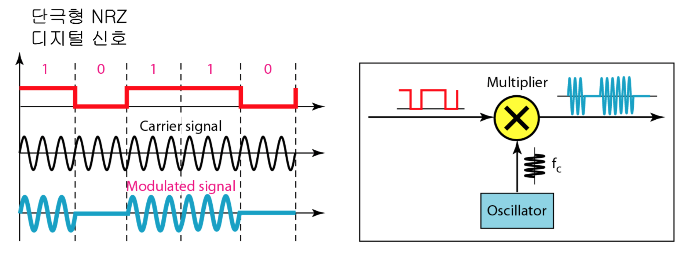
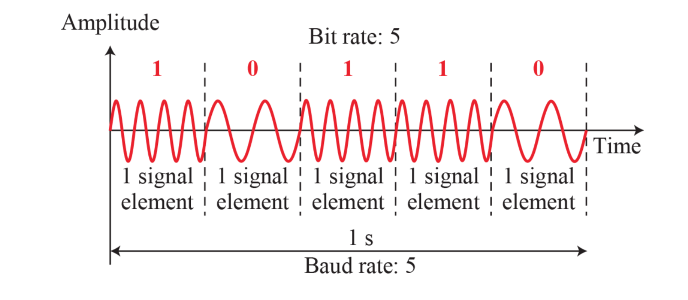
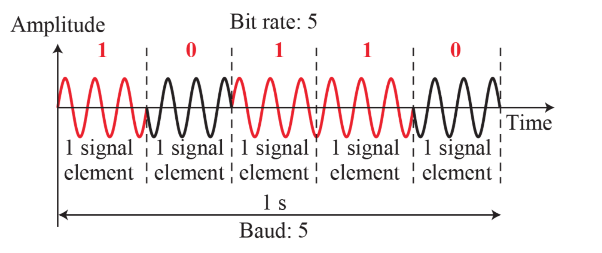
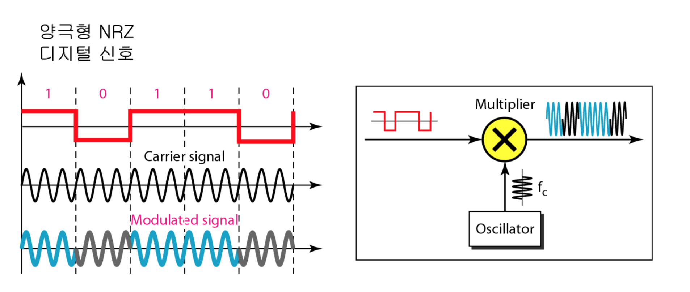
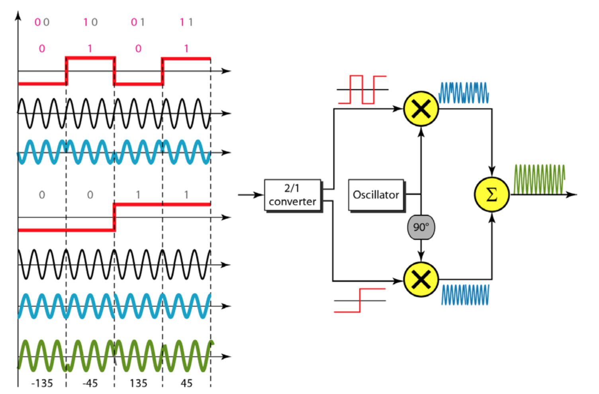
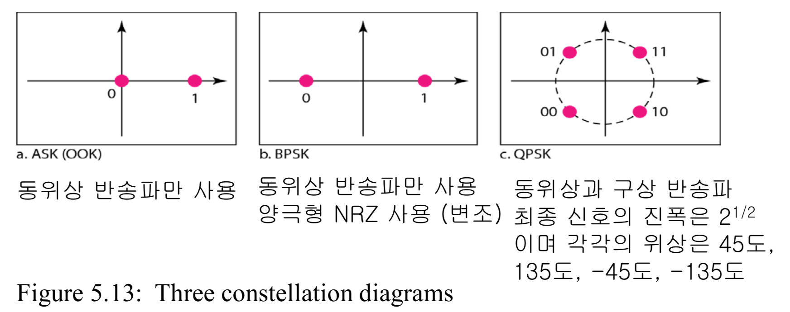
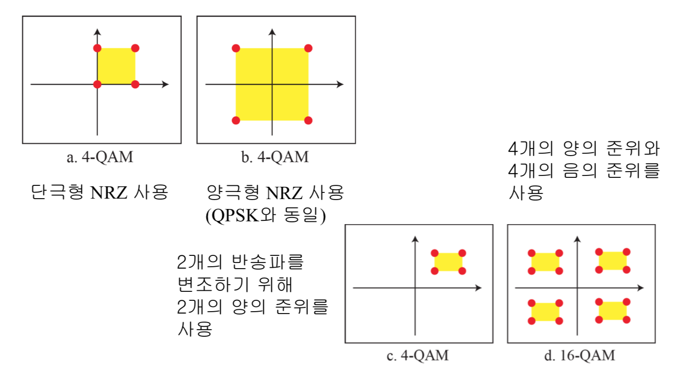

# Analog Transmission

## Digital-to-Analog conversion
- ASK: 진폭 편이 변조
    
- FSK: 주파수 편이 변조
    
- PSK: 위상 편이 변조
    
- BASK: 위상 180도 신호요소는 위상 0도의 신호요소를 뒤집은것
    
- QPSK: 각 신호 요소마다 동시에 2 비트를 사용할 수 있는 방법을 고안, 두 개의 개별적인 BPSK 변조기 사용 (위성 방송에 사용)
    
- 성운그림
    
- QAM: 진폭 구상 변조
    - 위상을 X 만큼 바꾸고 진폭을 Y만큼 바꾸면 X 곱하기 Y만큼의 가능한 변화와각변화당상응하는수의비트가발생
    - 케이블 TV 전송에 사용
    
## Analog-to-Analog conversion
- AM: 진폭 변조
- FM: 주파수 변조
- PM: 위상 변조

## 레퍼런스
- Data Communications ans Networking (Behrousz A. Forouzan)