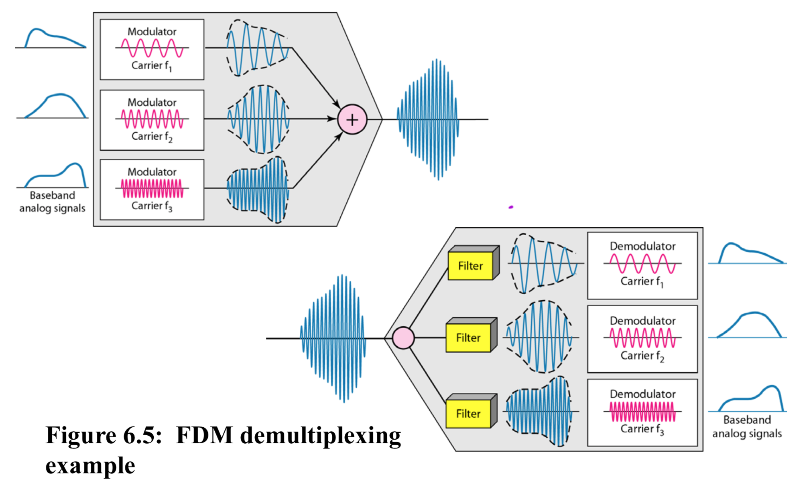
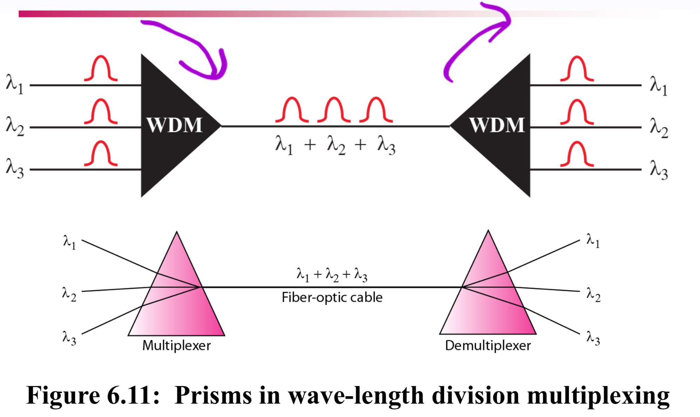
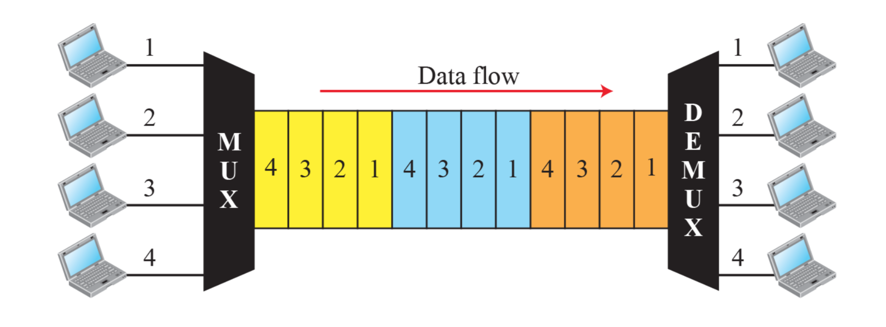
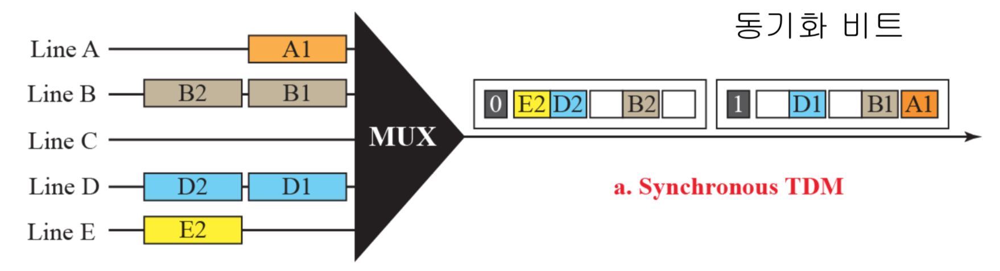
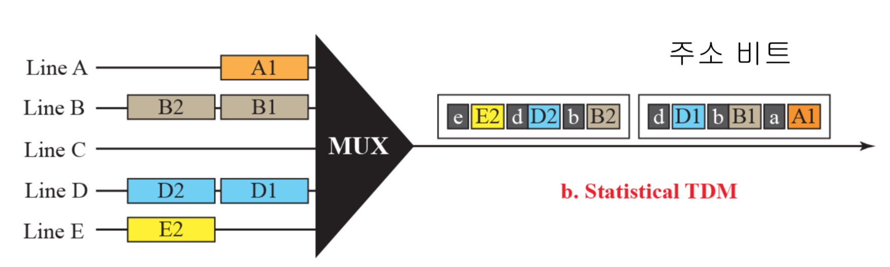

# Bandwidth Utilization
## Multiplexing (다중화)
- FDM: 주파수 다중화
    - 채널들은 신호가 겹치지 않도록 보호 대역 (guard bands) 만큼 서로 떨어져야 한다
    - 반송 주파수는 원래 데이터의 주파수와 간섭(잡음)을 일으키지 않아야 한다
    
    
- WDM: 파장 다중화
    
- TDM: 시간 다중화
    - 채널별로 타임을 나누어줌
    - 광 케이블에 쓰임

    
## TDM
- Synchronized TDM
    - 비효율적

    
- Statistical TDM
    
## 레퍼런스
- Data Communications ans Networking (Behrousz A. Forouzan)