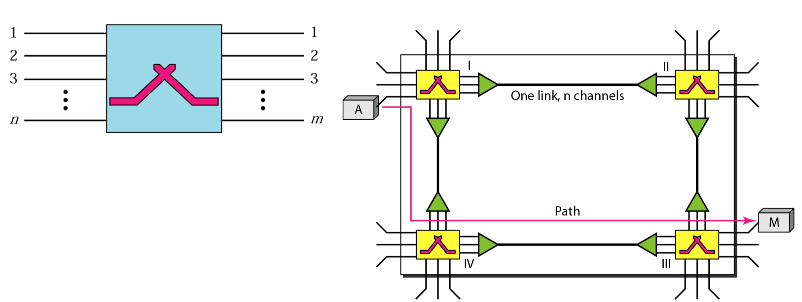
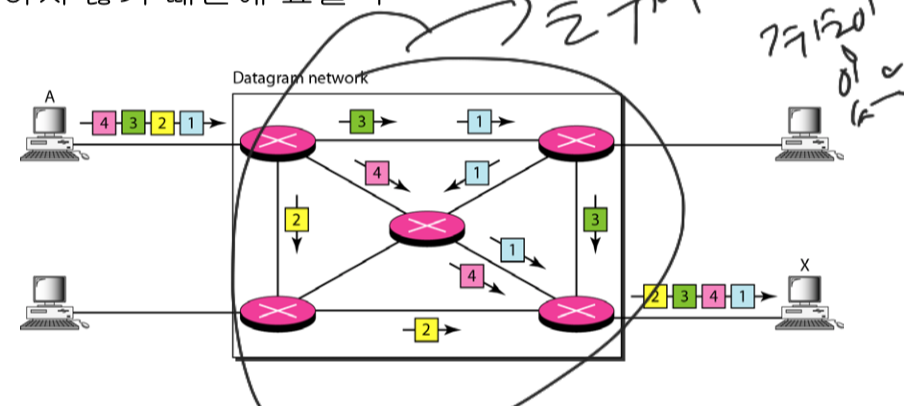
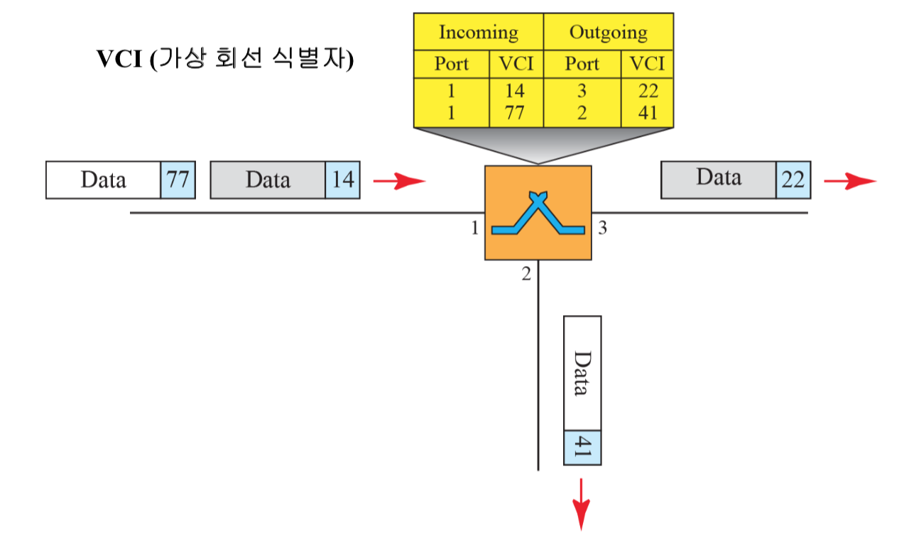

# Switching
교환기 (Switch)에 연결된 둘 이상의 장치 사이에 임시적인 연결을 만들 수 있는 장치

## circuit switching (회선 교환)
- 통신망에서 데이터를 전송할 때사전에 연결된 고정회선을 통하여 전송하는 방식
- 한번 연결되면 통화가 완료될 때 까지 전송할 데이터의 유무에 관계없이 회선을 점유
- Telephone network에 사용
- Circuit switch system
    - n개의 입력과 m개의 출력을 갖는 장치
    
## packet switching
- 통신망에서 데이터를 전송할 때 사전에 회선의 결정이 이루어지지 않음
- 각각의 패킷별로 주소 (IP)를 갖고 목적지를 찾아간다
- 회선을 점유하지 않기 때문에 효율적

## Virtual circuit network(가상 회선 망)
- 회선 교환과 데이타그램 네트워크를 섞은 형태
- 회선 교환과 같이 설정단계와 해제 단계가 있음
- 자원이 설정 단계에서 할당되거나 필요에 따라 할당될 수 있음
- 데이타의 전송은 패킷과 같이 헤더에 주소를 담아 목적지를 찾아 감
- 연결이 설정되고나면 모든 패킷은 같은경로를 따라 전송된다

## 레퍼런스
- Data Communications ans Networking (Behrousz A. Forouzan)