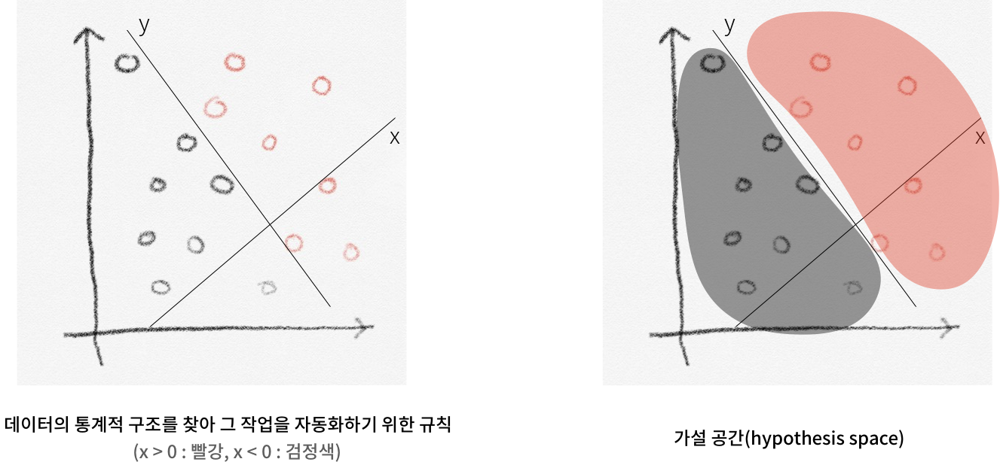

# 딥러닝이란 무엇인가?
## 인공지능과 머신러닝, 딥러닝

    

인공지능이라는 범주에 머신러닝과 딥러닝이 포함이 된다.

    

인공지능은 **심볼릭 AI**와 **머신러닝**으로 구분이 되는데, **심볼릭 AI**는 판단에 대한 규칙을 명시적으로 코딩하고있는 전통적인 프로그램으로 규칙과 데이터를 가지고 해답을 출력한다. 그에 비하여 **머신러닝**은 명시적으로 프로그램되는 것이 아니라 **훈련**을 통해 시스템이 동작하며, 데이터와 해답을 입력으로하여 규칙을 출력으로 발생시킨다.

> **훈련**: 데이터의 통계적 구조를 찾아 그 작업을 자동화하기 위한 규칙을 찾는 것

### **머신 러닝을 위한 3가지**

머신러닝을 하기 위해서는 다음의 3가지가 필요하다.

- 입력 데이터 포인트
- 기대 출력
- 알고리즘의 성능을 측정하는 방법

예를 들어 다음과 같은 음파를 텍스트로 변환하는 모델을 만든다면 3가지 조건은 다음과 같다.

    

- 입력 데이터 포인트:  음성 사운드 파일
- 기대 출력: “Hello world”
- 알고리즘의 성능을 측정하는 방법: 알고리즘의 현재 출력과 기대 출력 간의 차이를 결정하기 위해 필요

    

위와 같은 경우에서 검은색과 빨간색을 분리하는 모델을 머신러닝으로 하고자 하면

- 입력 데이터 포인트:  포인트의 좌표
- 기대 출력: 포인트의 색상
- 알고리즘의 성능을 측정하는 방법: 정확히 분류한 포인트의 비율을 사용하여 알고리즘의 성능을 평가

위와 같은 요건이 필요함.

위를 머신러닝 하여 훈련시키면 다음과 같이 검정과 빨강을 분리할 수 있는 **가설공간(hypothesis space)** 을 구할 수 있게 됨.

    

### **딥러닝이란**

    

- 머신러닝의 한 분야로서 연속된 층(layer)에서 점진적으로 의미있는 표현을 배워나가는 모델
- 딥러닝의 deep은 깊은 통찰과 같은 의미가 아님.
- 딥러닝 == 계층적 표현 학습 == 층 기반 학습 모델

    

- 딥러닝은 얕은 학습과 딥러닝으로 구분됨

### **딥러닝의 작동원리**
딥러닝은 입력데이터와 가중치(weight)의 연산을 통해 결과를 발생시킨다.

    

결과적으로 딥러닝의 목표는 입력값에 대한 결과를 정확하게 예측할 수 있는 가중치를 계산하는 것.

**딥러닝 작동 흐름**

1. 입력 x가 신경망으로 입력어 각 계층의 가중치와 연산되어 예측 값 Ý가 산출됨

    

2. 산출된 Ý은 실제 값인 Y와 손실함수로 연산되어 송실 점수로 계산됨

    

3. 손실 점수는 옵티마이저를 통하여 각 계층의 가중치를 업데이트 하게됨

    

### **지금까지 딥러닝의 성과**

- 사람과 비슷한 수준의 이미지 분류
- 사람과 비슷한 수준의 음성 인식
- 사람과 비슷한 수준의 필기 인식
- 향상된 기계 번역
- 향상된 TTS 변환
- 구글 나우와 아마존 알렉사 같은 디지털 비서
- 사람과 비슷한 수준의 자율 주행 능력
- 구글, 바이두, 빙에서 사용하는 향상된 광고 타기팅
- 향상된 웹 검색 엔진의 결과
- 자연어 질문에 대답하는 능력
- 사람을 능가하는 바둑 실력

## reference
- François Chollet, 『케라스 창시자에게 배우는 딥러닝』. 박해선, 길벗(2018)